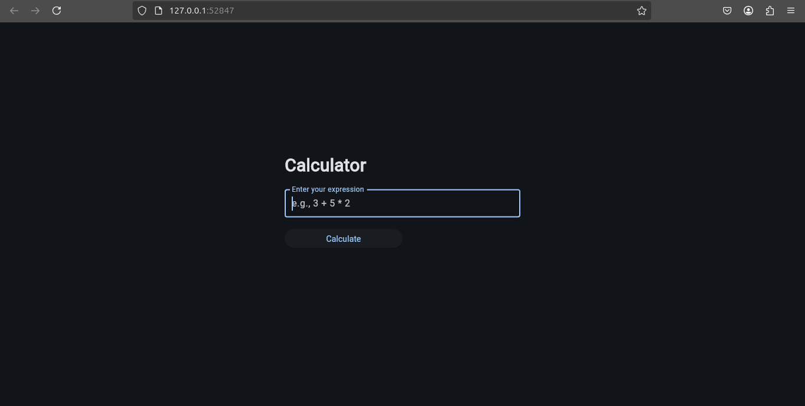
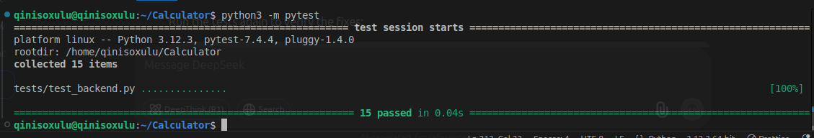

# Calculator Flet App



Welcome to the Calculator Flet project! In this project, you will implement a command-line calculator with basic and advanced mathematical functions. A basic, yet powerful calculator app built using Python. This project demonstrates the use of fundamental programming concepts such as functions, conditionals, and loops. It allows users to perform basic arithmetic operations including addition, subtraction, multiplication, division and more.


## Instructions

1. **Fork the Repository**:

   - Click the "Fork" button on the top right of this repository to create your own copy.

2. **Clone Your Fork**:

   - Clone your forked repository to your local machine:
     ```bash
     git clone https://github.com/YOUR_USERNAME/Calculator.git
     cd Calculator
     ```

3. **Implement the Functions**:

   - Open `backend.py` and implement the functions as described in the docstrings.
   - Test your implementation using the provided unit tests.

4. **Project Setup**:

    ### 1. Create the Virtual Environment  
    Run the following command in your project's root directory:

    #### On Windows:
    ```sh
    python -m venv venv
    ```

    #### On macOS/Linux:
    ```sh
    python3 -m venv venv
    ```

    This will create a new folder named `venv`, which contains a clean Python environment.

    ---

    ### 2. Activate the Virtual Environment  
    Before installing dependencies, you need to activate the virtual environment.

    #### On Windows (Command Prompt):
    ```sh
    venv\Scripts\activate
    ```

    #### On Windows (PowerShell):
    ```sh
    venv\Scripts\Activate.ps1
    ```

    #### On macOS/Linux:
    ```bash
    source venv/bin/activate
    ```

    Once activated, your terminal prompt should show `(venv)`, indicating that the virtual environment is active.

    ---

    ### 3. Install Dependencies from `requirements.txt`  
    Now, install everything listed in `requirements.txt`:

    ```sh
    pip install -r requirements.txt
    ```

    ---

    ### 4. Verify Installation  
    To confirm that `pytest` and `flet` were installed correctly, run:

    ```sh
    pip list
    ```
    This should display pytest, flet.

   - Run the tests:
     ```bash
     python3 -m pytest
     ```
     If all tests pass, they should appear like this:
     

   - Run frontend on 127.0.0.1 on your web browser i.e Chrome or Firecox:
     ```bash
     python3 frontend.py
     ```
     Try typing complex calculations  to test your application.

6. **Commit and Push Your Changes**:

   - Add your changes:
     ```bash
     git add calculator_functions.py
     ```
   - Commit your changes:
     ```bash
     git commit -m "Implemented calculator functions"
     ```
   - Push your changes to your branch:
     ```bash
     git push origin main
     ```

7. **Submit a Pull Request**:

   - Go to your forked repository on GitHub and click "New Pull Request".
   - Select your branch (`YOUR_NAME`) and submit the pull request to the main repository.

## Project Extension

In a few days, we will extend this project to create a mobile app using **Flet**. Stay tuned for updates!

## Running Tests

To run the tests, use the following command:

```bash
pytest tests/test_calculator_functions.py
```

## Make sure all tests pass before submitting your pull request.

#### Important Notes

```
- Only submissions from branches named after your name (e.g., monwabisi) will be accepted.

- Ensure your code is well-documented and follows best practices that we talked about.

- If you encounter any issues, feel free to ask for help!
```

##### Happy coding! 🚀

---

Co-authored-by: Qiniso Xulu <qiniso.nhlakanipho.xulu@gmail.com>
